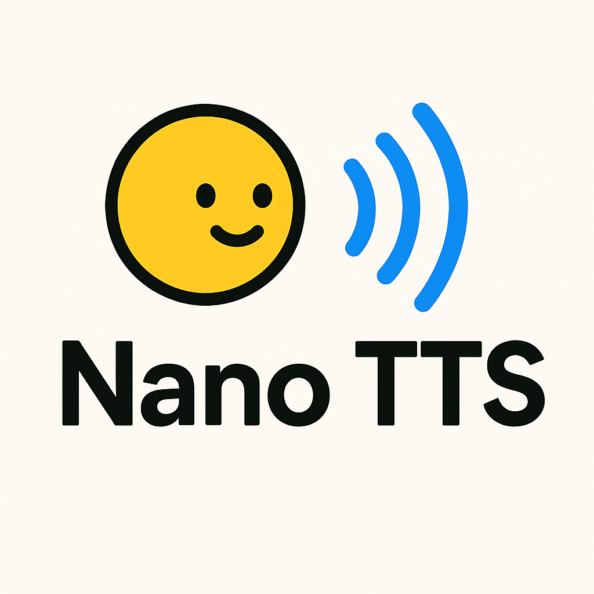

<div align="center">
<h2>
    SpeechPlus: Small LLM-Based Text-to-Speech Library 🚀
</h2>

</div>

SpeechPlus is a high-quality text-to-speech (TTS) library that supports multiple small language models and audio codecs. It creates natural-sounding speech by combining efficient language understanding with superior audio generation technology.

## 🛠️ Installation

```bash
uv venv --python 3.12
source .venv/bin/activate
uv pip install -r requirements.txt
```

## 🎙️ Usage

```python
from speechplus.inference import generate_speech_from_text

generate_speech_from_text(
    text="Hello, this is a demonstration of SpeechPlus.",
    model_path="./output/checkpoint-1000",
    tokenizer_path="./output/checkpoint-1000",
    output_path="generated_speech.wav",
    sample_rate=24000,
    max_length=2048,
)
```

### 🎵 Training

```python
python3 speechplus/train.py
```

## 😍 Contributing

```bash
uv pip install pre-commit
pre-commit install
pre-commit run --all-files
```

## 📜 License

This project is licensed under the terms of the Apache License 2.0.

## 🤗 Citation

```bibtex
@article{ji2024wavtokenizer,
  title={Wavtokenizer: an efficient acoustic discrete codec tokenizer for audio language modeling},
  author={Ji, Shengpeng and Jiang, Ziyue and Wang, Wen and Chen, Yifu and Fang, Minghui and Zuo, Jialong and Yang, Qian and Cheng, Xize and Wang, Zehan and Li, Ruiqi and others},
  journal={arXiv preprint arXiv:2408.16532},
  year={2024}
}

@article{ji2024language,
  title={Language-codec: Reducing the gaps between discrete codec representation and speech language models},
  author={Ji, Shengpeng and Fang, Minghui and Jiang, Ziyue and Huang, Rongjie and Zuo, Jialung and Wang, Shulei and Zhao, Zhou},
  journal={arXiv preprint arXiv:2402.12208},
  year={2024}
}
@misc{allal2025smollm2smolgoesbig,
      title={SmolLM2: When Smol Goes Big -- Data-Centric Training of a Small Language Model},
      author={Loubna Ben Allal and Anton Lozhkov and Elie Bakouch and Gabriel Martín Blázquez and Guilherme Penedo and Lewis Tunstall and Andrés Marafioti and Hynek Kydlíček and Agustín Piqueres Lajarín and Vaibhav Srivastav and Joshua Lochner and Caleb Fahlgren and Xuan-Son Nguyen and Clémentine Fourrier and Ben Burtenshaw and Hugo Larcher and Haojun Zhao and Cyril Zakka and Mathieu Morlon and Colin Raffel and Leandro von Werra and Thomas Wolf},
      year={2025},
      eprint={2502.02737},
      archivePrefix={arXiv},
      primaryClass={cs.CL},
      url={https://arxiv.org/abs/2502.02737},
}
```

## 📝 Acknowledgments

- SmolVoice: https://github.com/Deep-unlearning/SmolVoice
